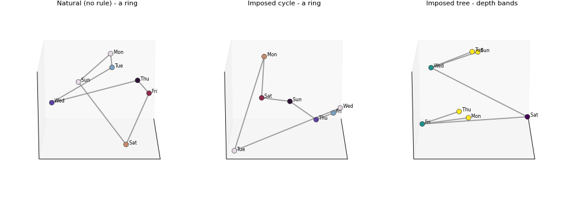

# Context Is King — reproducibility package

Code and cached data to reproduce *"Context Is King: How In-Context Specification
Shapes the Geometry of Concepts."*

The paper finds that relational geometry at the final pre-generation state
follows the in-context specification, including whether the same entities form
a cycle or hierarchy. Under conflict, this downstream geometry dominates the
pretrained prior in capable models. Activation patching separately localizes
the context-dependent binding of entity identity to the specified relation,
whose clean operation strengthens with scale.

<p align="center">
  
  <br>
  <em>The same seven weekdays in three contexts: no rule, an imposed cycle, and an imposed tree (Gemma-4-31B, 3-D PCA of entity centroids).</em>
  <br>
  <b>▶ Rotate it yourself:</b> download <a href="assets/shapes_3d.html"><code>assets/shapes_3d.html</code></a> and open it in a browser (self-contained, no install), or regenerate with <code>python figures/build_interactive_shapes.py</code>.
</p>

## What's here

The package is split into two layers:

- **`figures/`** — CPU-only. Reads figure-ready cached artifacts from `data/`
  and redraws every paper figure. No GPU, no model weights. Machine-readable
  per-scramble or aggregate outputs supporting each table are also in `data/`.
- **`extract/`** — GPU. Regenerates the cached artifacts from model weights with
  HuggingFace `transformers`. Only needed if you want to rebuild from scratch.

```
context-is-king/
├── figures/          # LAYER 2 (CPU): cached data -> paper figures & tables
├── extract/          # LAYER 1 (GPU): model weights -> cached data
│   ├── geometry/ behavior/ causal/ shapes/ grid/ orchestrators/
│   └── README.md
├── data/             # curated figure caches + table-supporting outputs
│   └── README.md
├── docs/             # method specs (SPEC_*.md)
├── ARTIFACT_MAP.md   # paper object -> figure script -> data -> extraction script
├── PROVENANCE.md     # which regime each number was measured under (authority)
├── requirements.txt          # figure layer (CPU)
└── requirements-extract.txt  # extraction layer (GPU)
```

## Quickstart — reproduce all 14 figures (no GPU)

```bash
pip install -r requirements.txt

# All figure-ready data is committed, so every figure reproduces straight
# from the clone -- no download, no GPU.
cd figures
python make_all.py
# ...or a single figure:
python fig_dominance.py
```

Figure scripts find data via the `CIK_DATA` environment variable, defaulting to
`./data`. Point it elsewhere with `CIK_DATA=/path/to/data python figures/....py`.

See `ARTIFACT_MAP.md` for the exact figure/table→script→data mapping and
`data/README.md` for the curated-data policy. To keep the anonymous repository
manageable, large table-only raw activation arrays are omitted where compact
per-scramble or aggregate outputs suffice; the GPU extraction scripts remain.

## Regenerate cached data from model weights (GPU)

See `extract/README.md`. In short: install `requirements-extract.txt` (Gemma-4
loading is `transformers`-version-sensitive; details there), then invoke the
relevant extraction script directly, e.g.:

```bash
python extract/geometry/multiscr.py google/gemma-4-31B-it --concepts days,months --nscr 10 --noexamples
python extract/causal/causal_use.py google/gemma-4-31B-it --nscr 20
```

Extraction writes a legacy-compatible `results/` tree. Set `CIK_DATA=results`
when redrawing from freshly extracted artifacts. The checked-in `data/` tree is
the curated, publication-sized subset used by the CPU quickstart. Historical
batch launchers remain under `extract/orchestrators/` for provenance, but the
documented interface is the individual extraction script.

## Models

Instruction-tuned `google/gemma-4-{E2B,E4B,12B,31B}-it`,
`Qwen/Qwen3.5-{4B,9B,27B}`, and `meta-llama/Llama-3.1-8B-Instruct`.

## Citation

```bibtex
@misc{anonymous2026contextisking,
  title  = {Context Is King: How In-Context Specification Shapes the Geometry of Concepts},
  author = {Anonymous Authors},
  year   = {2026}
}
```
